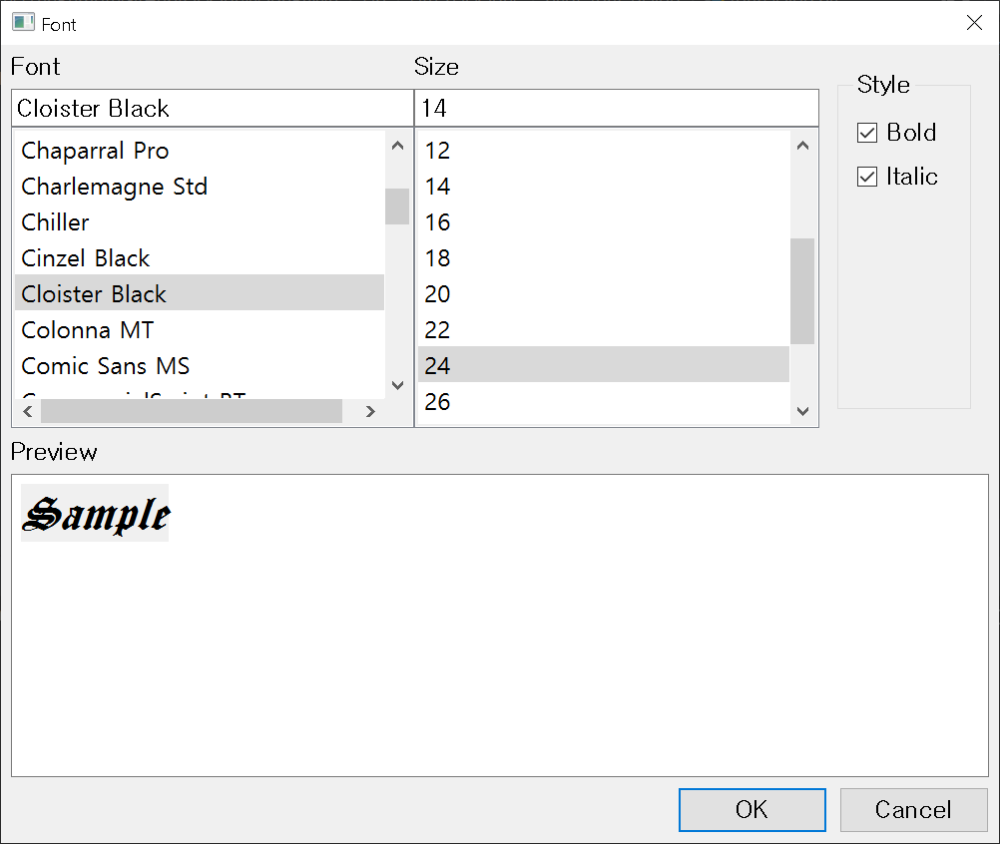

# pyqt-font-dialog
Font dialog made with PyQt

## License
MIT

## Requirements
PyQt5 >= 5.8

## Usage
```python
dialog = FontDialog()
reply = dialog.exec()
if reply == QDialog.Accepted:
    self.__mainTextEdit.setCurrentFont(dialog.get_font())
```

## Preview

